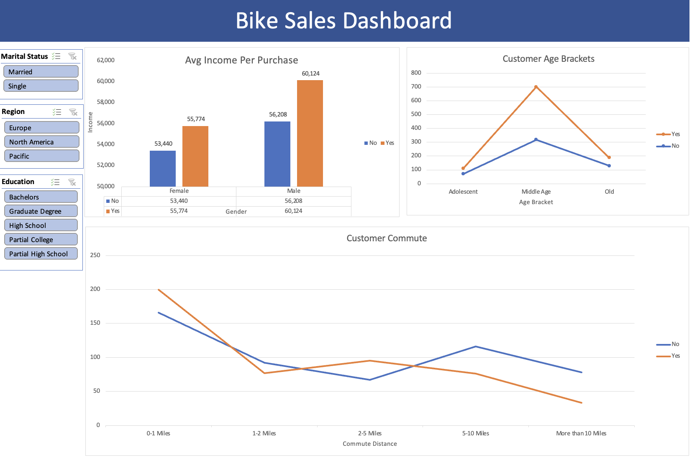

# 🚲 Bike Sales Dashboard (Excel Project)

## Project Overview
This project involves analyzing a dataset of bike buyers to identify trends and customer demographics. Using Excel, I cleaned the raw data, created pivot tables, and built an interactive dashboard to visualize factors influencing bike purchase decisions.

**Author:** Yichen Wang
**Guided by:** Alex The Analyst (Data Analytics Bootcamp)

## 📊 Dashboard Preview

*(Note: Please make sure the screenshot filename matches exactly!)*

## 🛠️ Process & Workflow

### 1. Data Cleaning
*(Checked and cleaned raw data in the 'Working Sheet')*
* **Removed Duplicates**: Eliminated 26 duplicate records to ensure data accuracy.
* **Standardization**: 
    * Converted 'M'/'S' to 'Married'/'Single'.
    * Converted 'F'/'M' to 'Female'/'Male'.
    * Standardized currency formatting for Income.
* **New Variables**: Created an **"Age Brackets"** column using nested `IF` statements to categorize customers into *Adolescent*, *Middle Age*, and *Old*.

### 2. Analysis (Pivot Tables)
Created pivot tables to analyze key metrics:
* **Average Income per Purchase**: Compared income levels between buyers and non-buyers across genders.
* **Commute Distance**: Analyzed how commute distance correlates with bike purchases.
* **Age Demographics**: Broke down sales by age groups.

### 3. Visualization (Dashboard)
Built a dynamic dashboard with Slicers (Marital Status, Region, Education) to allow interactive filtering.

## 📈 Key Insights

* **Income Impact**: On average, male customers who purchased bikes had a higher income ($60,124) compared to those who didn't ($56,208).
* **Commute Distance**: Customers with a short commute (**0-1 Miles**) were the most likely to buy a bike (366 purchases).
* **Age Group**: The **"Middle Age"** bracket is the primary target market, accounting for the highest volume of purchases compared to Adolescent and Old categories.

## 📂 Files Included
* `Bike Sales Project.xlsx`: The complete Excel workbook with raw data, working sheets, and the dashboard.
* `dashboard_screenshot.png`: A preview of the final dashboard.
